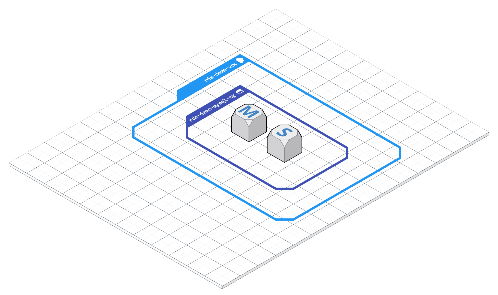

# RDS deep-dive

This script will deploy a multi_az RDS instance within a VPC.



# Learning objectives
- know the components of an RDS instance
- deploy a fault tolerant rds cluster
- Connect to an RDS instance remotely
- secure your instance from the public

# Resources
- RDS
- VPC
- Security Group
- Terraform

# Prerequisites
- AWS Account with a profile configured
- Terraform
- MySQL GUI app (or cli)  https://www.sequelpro.com/

# Install
```
git clone git@github.com:awshonolulu/rds-deep-dive.git
cd alb-deep-dive.git
terraform init
```

# Dry run
```
terraform plan
```
